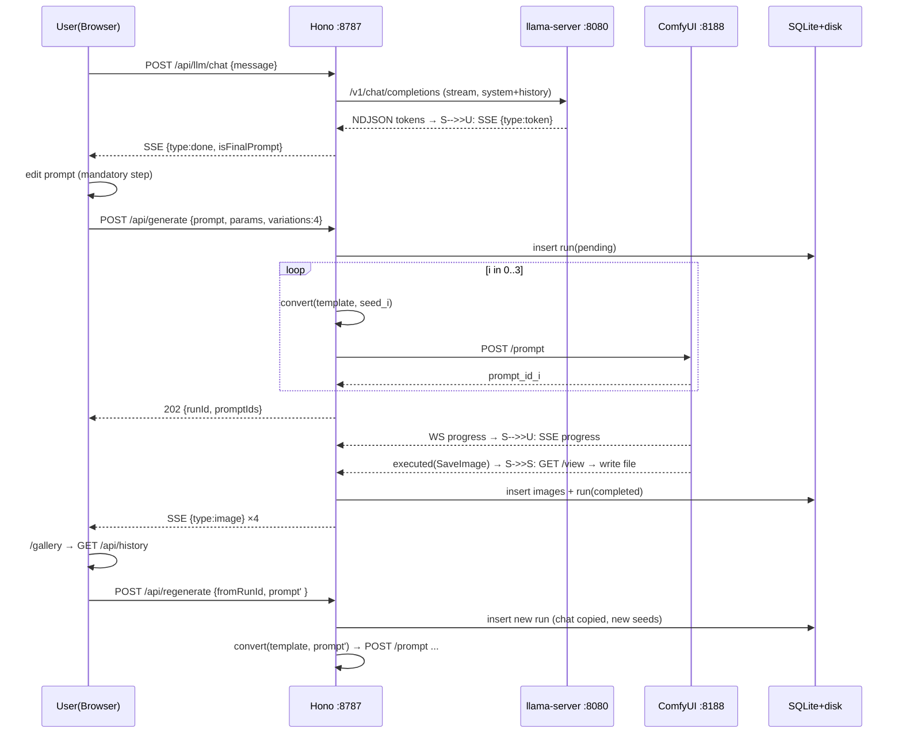

# Design: Prompt Studio — Local AI Prompt Designer for ComfyUI

## Technical Approach

Local-first npm-workspaces monorepo: `apps/web` (React + Vite + TS + Tailwind + shadcn/ui) and `apps/server` (Hono + better-sqlite3) share types via a source-only `packages/shared`. The server proxies ComfyUI (browser never touches it — CORS verified broken), converts the committed UI-format workflow template to API format, spawns the vendored `llama-server.exe` for the Spanish interview, and persists runs in SQLite with images on disk. Maps to specs: interview-assistant (chat, chips, editable prompt), comfyui-integration (proxy, conversion, submit/poll/SSE), generation-options (params, aspect, variations), history-gallery (SQLite, compare, regenerate), llm-runtime (spawn/health/orphan protection).

## Architecture Decisions

### Decision: Monorepo layout & ports
**Choice**: npm workspaces; root + `apps/web` + `apps/server` + `packages/shared`.
**Alternatives**: single package; separate repos.
**Rationale**: one `npm install`, shared DTOs/types without a registry; matches proposal.
**Layout** (pre-scaffold, all files Create):
```
prompt-studio/
├─ package.json            workspaces:["apps/*","packages/*"]; scripts: dev, build, test, lint, typecheck
├─ tsconfig.base.json      strict; paths: @promptstudio/shared -> packages/shared/src
├─ .env.example            (no secrets; see Config)
├─ assets/
│  ├─ workflows/workflow_fotorealista_qwen.json    committed byte-copy of template
│  └─ fixtures/fotorealista.api.golden.json        golden converter output
├─ packages/shared/        @promptstudio/shared — SOURCE ONLY (no build; aliases point to src)
│  └─ src/{types.ts, dto.ts, aspect.ts, detectFinalPrompt.ts, validation.ts}
├─ apps/web/               @promptstudio/web — vite.config.ts proxies /api -> 127.0.0.1:8787
└─ apps/server/            @promptstudio/server (type: module) — port 8787
```
**Ports**: web 5173 (Vite default) · server 8787 · llama-server 8080 · ComfyUI 8188 (external).
**Env/config**: `apps/server/src/config.ts` reads `process.env` with defaults; optional root `.env` loaded via tsx `--env-file-if-exists=.env` (Node ≥22). Vars: `SERVER_PORT=8787`, `COMFYUI_URL=http://127.0.0.1:8188`, `COMFYUI_WS=ws://127.0.0.1:8188/ws`, `LLAMA_PORT=8080`, `LLM_BIN` (vendored llama-server.exe path), `LLM_MODEL` (Qwen3-4B GGUF), `LLM_SYSTEM_PROMPT` (director_fotografico.txt), `LLM_CTX=8192`, `DATA_DIR=./data`. No `.env` secrets — localhost-only app. **Bind**: Hono `serve({ hostname: '127.0.0.1' })` and Vite `server.host: '127.0.0.1'` — explicit loopback only; never 0.0.0.0 (app never exposed to LAN).
**Root scripts**: `dev` = concurrently `dev:server` (tsx watch) + `dev:web` (vite); `build` = `tsc --noEmit` (server+shared) + `vite build` (web); `test` = `vitest run`; `lint` = `eslint . --quiet`; `typecheck` = `tsc --noEmit`. `engine: node >=22`.

### Decision: UI→API conversion (highest risk) — deterministic pure function
**Choice**: `apps/server/src/services/converter.ts` — pure `convert(template, opts) → ApiWorkflow`; template read from committed asset `assets/workflows/` (copied at scaffold from the source path, never edited in place, never written back).
**Alternatives**: string-patch the JSON at runtime; hand-write a fresh API workflow.
**Rationale**: pure function = unit-testable; committed asset = reproducible golden; spec requires byte-identical template after conversion (converter is read-only by construction).
**Algorithm** (template facts verified from `workflow_fotorealista_qwen.json`, 28 nodes, links `[id, src, srcSlot, dst, dstSlot, type]`):
1. Load template; index nodes by `id`; build link index.
2. Drop nodes: `mode !== 0` (img2img 16–26, muted), `type === "Note"` (27–28, frontend-only), `id === 5` (LLMTextProcessor).
3. Remaining: 1,2,3,4,6,7,8,9,10,11,12,13,14,15 (upscale branch kept).
4. For each kept node: `class_type = type`; `inputs = {}`. For each entry of node's `inputs` array with a `link`: resolve link → `inputs[name] = [srcId, srcSlot]` **if** srcId is kept; if srcId was dropped, this is an injection point (only case: node 6 `text` ← node 5) — replace with configured value (final prompt) instead of a reference; if any other dropped-source link appears → throw `ConversionError` (deterministic contract, asserts template invariants).
5. Widgets → inputs: static table `WIDGET_NAMES: Record<classType, string[]>` mapping `widgets_values` order to API input names, dropping non-API entries (`control_after_generate` "randomize"). Required for kept classes: UnetLoaderGGUF `[unet_name]`; ModelSamplingAuraFlow `[shift]`; CLIPLoader `[clip_name, type, device]`; VAELoader `[vae_name]`; CLIPTextEncode `[text]`; EmptySD3LatentImage `[width, height, batch_size]`; KSampler `[seed, steps, cfg, sampler_name, scheduler, denoise]`; SaveImage `[filename_prefix]`; ImageScale `[upscale_method, width, height, crop]`. Linked inputs (clip/model/vae/images/positive/negative/latent_image/samples/upscale_model) are reference-only.
6. Injection (explicit opts, all overrides template): node 6 `inputs.text = finalPrompt`; node 7 untouched (fixed negative from template widget); node 8 `width/height` from aspect map (or custom) and `batch_size`; node 9 `seed` per variation, `steps/cfg/sampler_name/scheduler/denoise` from params (defaults steps 20, cfg 2.5, euler, simple, denoise 1.0).
7. Output: flat `{ "1": {class_type, inputs}, ... }` keyed by string node id — the ComfyUI `/prompt` payload.

**img2img (optional, OFF)**: when `img2img.enabled`, converter keeps nodes 16–26 (mode ignored), sets node 16 `image = uploadedFilename`, KSampler 20 keeps template denoise 0.45. Source image uploaded to ComfyUI via its HTTP `POST /upload/image` (standard API, writes only to ComfyUI's user-data input dir — no install modification).

**Golden fixture strategy**: fixture = committed `assets/fixtures/fotorealista.api.golden.json` — converter output for canonical opts `{prompt:"golden test prompt", width:1024, height:1024, seed:12345, steps:20, cfg:2.5, batchSize:1}`. Test 1: `convert()` deep-equals golden. Test 2 (immutability): converter never writes; template asset byte-compared to source file when present (`SHA-256` recorded). Regenerate golden with `-u` flag only after deliberate review. Dev-time verification script `apps/server/src/scripts/verifyAgainstObjectInfo.ts` cross-checks `WIDGET_NAMES` against live `/object_info` (manual run; ComfyUI may be offline in CI).

### Decision: Batch vs per-variation submission
**Choice**: server orchestrates **N separate `/prompt` submissions**, one per variation: `batch_size = 1`, `seed = baseSeed + i`.
**Alternatives**: single submission with `batch_size = N`.
**Rationale**: satisfies the observable spec scenarios literally — "node 9 seed differs per variation", "4 images with 4 distinct seeds" — plus per-variation progress via `/history/{prompt_id}`, per-variation error isolation, and 1:1 mapping to image rows. `batch_size` parameter still exists in converter (default 1) for future single-shot batch mode. This is an explicit interpretation of spec line "node 8 batch_size = batch": batch is expressed as submission count; `sdd-verify` must check scenarios, not that sentence.

### Decision: LLM lifecycle
**Choice**: `apps/server/src/services/llm.ts` spawns vendored `llama-server.exe` via `child_process.spawn` (explicit argv array, **no shell**):
`-m <Qwen3-4B gguf> -c 8192 -ngl 0 --port 8080 --host 127.0.0.1`
**Alternatives**: llama-cli one-shot subprocess; through ComfyUI LLM node.
**Rationale**: OpenAI-compatible server keeps LLM decoupled from the image queue, CPU-only (`-ngl 0`) avoids VRAM contention (exploration: torch holds ~9.4 GB of 16 GB; LLM 2.33 GB won't coexist with 12.34 GB UNet).
**Startup**: read system prompt from `director_fotografico.txt` verbatim into `data/.llm.pid` alongside spawn; poll `GET /health` (llama.cpp native) every 500 ms until `{"status":"ok"}` (timeout 120 s → error with binary path).
**Orphan protection** (spec: must not kill processes it didn't spawn):
1. If `127.0.0.1:8080/health` already answers `ok` → **adopt** the running instance (`pid: null`, `adopted: true`); never kill.
2. Else if PID file exists and process alive → verify identity: `execFile("powershell.exe", [fixed-script])` reading `Win32_Process.ExecutablePath` for that PID (fixed script, PID interpolated as a *parameter*, never into shell syntax); kill **only** if path equals the vendored `llama-server.exe`; otherwise warn and leave untouched.
3. No PID file, port free → spawn.
**Shutdown**: on SIGINT/SIGTERM/`beforeExit`: if not adopted → `child.kill()`; remove PID file. PID file stores `{pid, exePath, startedAt}`.
**Streaming — DECISION: stream to browser**. `stream: true`; server parses NDJSON deltas and relays as SSE `{type:"token"}` events, `{type:"done", full, isFinalPrompt}` at end. Rationale: 4B on CPU is slow (~10–25 tok/s); a 30–60 s blank wait is unacceptable; streaming also enables client cancel (AbortController kills upstream request).
**Conversation state — DECISION: server-side per-session**. `Map<sessionId, ChatMessage[]>` in memory; system prompt held server-side; client sends only `{sessionId?, message}`. Rationale: keeps full history + system prompt on server (proposal requirement), avoids client payload growth, enables replay persistence. Session = one interview; cap 40 messages (drop oldest pairs); GC idle 30 min. On generate, `chat_json` snapshot copied to the run row (history-gallery "conversation persistence").

### Decision: SQLite schema & storage
**Choice**: better-sqlite3, DB at `data/prompt-studio.db`; images at `data/images/<runId>/<variationIndex>_<seed>_<filename>`; DB stores **relative** paths (portable if folder moves), resolved against `DATA_DIR` at runtime.
**Migrations — DECISION: numbered SQL files + `PRAGMA user_version`**, applied in one transaction on boot. `apps/server/src/db/migrations/001_init.sql`; future changes are additive files. Rationale: deterministic, testable, non-destructive (single-schema-file would force destructive edits).
```sql
CREATE TABLE runs (
  id TEXT PRIMARY KEY, created_at TEXT NOT NULL DEFAULT (datetime('now')),
  status TEXT NOT NULL,               -- pending|running|completed|failed
  prompt TEXT NOT NULL, negative_prompt TEXT,
  params_json TEXT NOT NULL,          -- {steps,cfg,sampler_name,scheduler,denoise,width,height,aspect}
  seeds_json TEXT NOT NULL,           -- [s0..sN-1]
  prompt_ids_json TEXT NOT NULL,      -- [comfyui prompt_id per variation]
  chat_json TEXT NOT NULL DEFAULT '[]',
  error TEXT
);
CREATE TABLE images (
  id TEXT PRIMARY KEY, run_id TEXT NOT NULL REFERENCES runs(id) ON DELETE CASCADE,
  variation_index INTEGER NOT NULL, seed INTEGER NOT NULL, comfyui_prompt_id TEXT,
  kind TEXT NOT NULL,                 -- base|hd (SaveImage 11 vs 15)
  local_path TEXT NOT NULL,           -- relative to DATA_DIR
  thumbnail_path TEXT,                -- relative to DATA_DIR (320px webp preview; null until generated)
  filename TEXT NOT NULL, width INTEGER, height INTEGER,
  created_at TEXT NOT NULL DEFAULT (datetime('now'))
);
CREATE INDEX idx_images_run ON images(run_id);
```
Parameterized statements only; run ids/filenames never interpolated into SQL.

**Image serving hardening** (`GET /api/history/:runId/images/:file`): resolve `path.resolve(DATA_DIR, rel)` and assert the result stays under `DATA_DIR`; reject absolute paths and `..` segments; serve only whitelisted extensions (`.png`, `.jpg`, `.webp`) with correct `Content-Type`, `Content-Disposition: inline`, and `X-Content-Type-Options: nosniff` (a foreign/uploaded file can never render as HTML). Traversal guard gets a RED integration test.
**Thumbnails**: server generates small previews for gallery/list (`data/images/<runId>/thumbs/<variationIndex>.webp`, max ~320px, via `sharp`) at ingest time; gallery uses lazy `loading="lazy"` + `decoding="async"`; full-res (up to 4096px HD) loads only in the focused `ImageViewer`. `images.thumbnail_path` column added below.

### Decision: Frontend architecture
**Routes** (react-router): `/` Interview (chat) · `/review` Review/Edit prompt + options + run summary · `/gallery` list · `/gallery/:runId` detail (images, params, chat replay, compare, regenerate). Top nav: "Estudio" / "Galería" + theme toggle.
**Stack**: Vite + React 18 + TS + Tailwind + shadcn/ui (baseColor stone, cssVariables true, `class` dark strategy). State: **zustand** stores (`useChatStore`, `useRunStore`, `useGalleryStore`) + thin `lib/api.ts` fetch/SSE wrapper (EventSource for progress). No React Query (single user, local).
**Theming**: custom minimal `ThemeProvider` (class strategy, localStorage, system default) — no next-themes dependency; shadcn `--background/--foreground/--primary` CSS vars in `globals.css`.
**Motion**: framer-motion only for chat message entrance + route transitions; typing dots CSS keyframes. Deliberate restraint (frontend-design: less is more on a local CPU-bound tool).
**Design tokens** (impeccable audit pass — darkroom/estudio fotográfico identity; **full per-theme token set**, both themes WCAG AA):
| Role | Dark | Light (own set, AA-verified) |
|---|---|---|
| bg / surface | `#0E0E0F` / `#1A1A1C` | `#F5F3EF` / `#FFFFFF` |
| text | `#F4F2EE` (17.3:1) | `#1A1A1C` (14.9:1) |
| muted | `#8A8A90` (5.6:1) | `#6B6B70` (4.6:1 — NOT the dark muted) |
| accent (safelight amber) | `#E8A33D` (8.4:1 on surface) | `#B8790F` (4.6:1 on white; amber must carry dark text `#0E0E0F` on fills) |
| success / error | `#7FB069` / `#D95555` | `#3F7A2F` / `#B93A3A` |
| focus ring | accent (dark) / `#B8790F` (light) | — |
| display type | Fraunces (wordmark, empty states, final-prompt hero ONLY — never labels/buttons/data) | same |
| body | Inter | same |
| data/utility | JetBrains Mono — seeds, steps, cfg as **muted mono** with amber reserved for STATE (active variation, hovered seed, live progress); never full-amber static strip (dilutes CTA signal) | same |

**State & status language**: never color-only — every success/error/status pairs an icon + text label (✓ "Completado" / ⚠ "Falló — nodo X"); red/green used as reinforcement, not sole signal.
**Spanish (AR) strings**: `apps/web/src/lib/strings.ts` — nested object (no i18n framework), e.g. `strings.chat.title`, `strings.options.steps`; keys structured by feature for future i18n. Quick-reply chips from `strings.chips` for the 4 axes (subject, clothing, lighting/mood, style) with rioplatense suggestions. Include designed error copy per API code ("ComfyUI está apagado. Abrí el launcher y tocá 'Reintentar'." / "El motor de IA todavía está arrancando…") and a first-run hint explaining why the final prompt is in English.
**Component tree**: `AppLayout` → `Header`(ThemeToggle, Nav, LLM status pill) · `InterviewView` → `MessageList`(`role="log"` + `aria-live="polite"`, buffered announcements) / `MessageBubble`(React.memo) / `TypingIndicator`(`role="status"`) / `QuickReplyChips`(radiogroup + roving tabindex + arrows) / `ChatInput`(disabled until LLM ready; cancel/stop button while streaming) · `ReviewView` → `PromptEditor`(validation: empty blocks submit) / `OptionsPanel`(**defaults collapsed under "Avanzado"**: sampler, scheduler, seed; visible: steps, cfg) / `AspectPicker`(5 presets + custom; radiogroup) / `VariationSlider`(1–8, native `input[type=range]`) / `RunSummaryCard`(derived info: count, estimated time — never duplicate controls) / `GenerateButton`(disabled + explainable when empty prompt / 409 busy / LLM not ready) · `GalleryView` → `RunList`/`RunCard`(lazy images, skeleton loading, empty state with first-run welcome) · `RunDetailView` → `ImageViewer`(full-res only here; alt from prompt summary + mono camera-info figcaption)/`CompareView`/`ChatReplay`/`RegenerateButton`("mantener semilla" checkbox) · `ProgressView` (per-variation SSE bars throttled ~1–4/s; **Cancel button** → `DELETE /api/generate/:runId`; keeps "lo que pedí" prompt visible while bars fill).
**Responsive floor**: desktop-first, min 1024px; one `lg` breakpoint where ReviewView collapses to single column; touch targets ≥44px; `rem` typography so Windows 125–150% DPI scaling doesn't overflow. (Casey persona acceptable-excluded: local Windows tool, mobile out of scope v1.)
**Motion & a11y**: `MotionConfig reducedMotion="user"`; typing dots gated via `@media (prefers-reduced-motion: reduce)`; visible focus ring on every interactive element (per-theme ring); focus managed on route transitions (skip to main, restore on back).
**Chat resilience**: `sessionId` persisted in `sessionStorage` (survives refresh, dies with tab); hydrate `useChatStore` from `GET /api/llm/chat/:sessionId` on mount; a refreshed tab mid-interview rejoins the server session.
**Refresh-mid-generation recovery**: on app mount, `GET /api/generate/:runId` detects an active run and restores ProgressView; EventSource reconnect replays missed per-variation states from the server before continuing.

### Decision: API contract
Error convention: JSON `{error: {code, message, details?}}`; codes 400 validation, 404 not found, 409 busy (run already active) / conflict, 422 conversion error, 502 ComfyUI unreachable, 503 LLM not ready, 500 unexpected.
| Method & path | Req | Res |
|---|---|---|
| GET `/api/health` | — | `{status, comfy:{reachable,version}, llm:{status,port,adopted}}` |
| GET `/api/llm/status` | — | `{ready, port, model, adopted}` |
| POST `/api/llm/chat` | `{sessionId?, message}` | 200 SSE: `{type:"token",text}`…`{type:"done",full,isFinalPrompt}` / `{type:"error",message}` |
| GET `/api/llm/chat/:sessionId` | — | `{sessionId, messages}` (capped list; refresh/resume hydration) |
| POST `/api/generate` | `{prompt, negativePrompt?, seed?, steps, cfg, sampler, scheduler, width, height, aspect?, variations, img2img?}` | 202 `{runId, promptIds}` |
| GET `/api/generate/:runId/events` | — | SSE progress (per variation queued/started/progress/complete + `{type:"image",runId,variationIndex,url}`) |
| GET `/api/generate/:runId` | — | `{status, images, error?}` (poll fallback + refresh recovery) |
| DELETE `/api/generate/:runId` | — | 202 `{status:"cancelling"}` (marks run cancelled, stops remaining submissions, WS relay ignores post-cancel events; final state `cancelled`) |
| POST `/api/regenerate` | `{fromRunId, prompt?, params?, keepSeed?}` | 202 `{runId, promptIds}` (new run; if `keepSeed` reuse original seeds, else new seeds; chat copied) |
| GET `/api/history?limit&offset` | — | `[{id, created_at, status, prompt, aspect, variations, thumbnail}]` |
| GET `/api/history/:runId` | — | run + images + chat + params |
| GET `/api/history/:runId/images/:file` | — | image bytes (traversal-guarded) |
| DELETE `/api/history/:runId` | — | 204 (row + files deleted) |
| POST `/api/images/upload` | multipart | `{filename}` (img2img; forwards to ComfyUI `/upload/image`) |
| GET `/api/comfy/system_stats` · `/api/comfy/object_info` | — | passthrough (dev/verification) |

Server→ComfyUI (direct): `POST /prompt`, `GET /history/{id}`, `GET /view?filename&subfolder&type`, `GET /object_info`, `GET /system_stats`, `WS /ws`, `POST /upload/image`.

### Decision: Async execution flow (server orchestrator, `generation.ts`)
`POST /api/generate` → 409 if another run active → insert run row (pending) → for i in 0..N-1: convert(template, {prompt, params, seed: base+i, batch 1}) → POST /prompt → collect prompt_id → update run (running, prompt_ids) → respond 202. Background: one WS client to `ws://127.0.0.1:8188/ws` relays `progress`/`executed` messages for the run's prompt_ids to its SSE subscribers; on SaveImage executed → fetch via `/view` → write `data/images/` → insert image row → emit `{type:"image"}`. Completion when all N history entries `status.completed`; else `failed` with failing node + message (spec: surface error). Sequential — one run at a time (VRAM-safe).

## Data Flow

```
Browser ──SSE──> server ──ws/relay──> ComfyUI :8188
   │              │
   └──/api──> Hono :8787 ──HTTP──> ComfyUI /prompt /history /view
                    │
                    ├──spawn──> llama-server.exe :8080 (CPU, /v1/chat/completions)
                    │
                    └──write──> SQLite data/prompt-studio.db + data/images/
```



## File Changes

| File | Action | Description |
|---|---|---|
| `package.json`, `tsconfig.base.json`, `.gitignore`, `.env.example` | Create | Workspaces root, scripts, strict TS, no-secrets env |
| `packages/shared/src/{types,dto,aspect,detectFinalPrompt,validation}.ts` | Create | Run/params/DTO types; `aspectToSize()` map; `detectFinalPrompt()`; bounds validation |
| `assets/workflows/workflow_fotorealista_qwen.json` | Create | Committed template copy (copied once from source, read-only) |
| `assets/fixtures/fotorealista.api.golden.json` | Create | Golden converter output |
| `apps/server/src/index.ts` | Create | Hono app (bind 127.0.0.1), static/API wiring, llm boot, shutdown hooks |
| `apps/server/src/config.ts` | Create | Env defaults (loopback binds documented) |
| `apps/server/src/services/{converter,llm,comfy,generation,thumbs}.ts` | Create | Core logic (see decisions) + sharp thumbnail generation |
| `apps/server/src/db/{migrate.ts,migrations/001_init.sql}` | Create | Migrations + `PRAGMA user_version` (images.thumbnail_path) |
| `apps/server/src/lib/{sse.ts,ws-relay.ts}` | Create | SSE framing; ComfyUI WS relay |
| `apps/server/src/routes/{llm,generate,history,comfy,health}.ts` | Create | REST endpoints (incl. DELETE /api/generate/:runId, GET /api/llm/chat/:sessionId, hardened image route) |
| `apps/server/src/scripts/verifyAgainstObjectInfo.ts` | Create | Dev-time WIDGET_NAMES verification vs live ComfyUI |
| `apps/server/test/*` | Create | Unit + integration tests (vitest; incl. cancel, session restore, traversal RED) |
| `apps/web/src/{main.tsx,App.tsx}` + `routes/`, `components/`, `stores/`, `lib/{api,strings}.ts`, `globals.css` | Create | UI per frontend decision (a11y: live region, reduced-motion, keyboard models; per-theme tokens; thumbnails lazy-load) |

## Testing Strategy

| Layer | What | Approach |
|---|---|---|
| Unit | converter + golden + immutability; aspect map; seed derivation; `detectFinalPrompt` (golden messages: Spanish question → false, English paragraph → true, passthrough → true); bounds validation (variations 1–8); history repo CRUD; `migrate()` user_version; thumbnail path derivation | vitest, pure functions, committed fixtures |
| Integration | server endpoints with **mocked ComfyUI client** (fake `/prompt`, `/history`, `/view`, WS emitter) and fake spawn + fake `/health` server for llm service; SSE relay framing; orphan decision logic (adopt / kill-matching-exe / foreign-process-leave); 202/409/422/502/503 paths; **cancel flow** (DELETE stops submissions, post-cancel WS events ignored); **chat session restore** (`GET /api/llm/chat/:sessionId` returns capped list); **image route traversal RED test** (absolute/`..`/ext whitelist/nosniff) | vitest + Hono `app.request()`; no real network |
| E2E | optional Playwright vs real ComfyUI + llama | not in CI; manual smoke |

Strict TDD enabled at scaffold (`openspec/config.yaml` testing.tdd → true; test_command `npm test`).

## Threat Matrix

| Boundary | Applicability | Design response | Planned RED tests |
|---|---|---|---|
| Documentation-like paths | N/A — no executable docs | — | — |
| Git repository selection | N/A — no git automation in app | — | — |
| Commit / Push state | N/A | — | — |
| PR commands | N/A | — | — |
| Subprocess / process lifecycle (llama-server spawn, kill, adopt, PID file) | **Applicable** | spawn with explicit argv (no shell, no string-built args); PID file `{pid, exePath}`; adopt when `/health` ok; kill only when WMI ExecutablePath matches vendored binary (fixed powershell script, PID passed as parameter, never interpolated); graceful shutdown hook | fake spawn capture asserts `shell:false` + exact args; orphan-cleanup kills only matching exePath; foreign-process branch leaves process untouched; port-busy-adopt branch via fake health |
| File/image serving (GET /api/history/:runId/images/:file) | **Applicable** | resolve-under-DATA_DIR assertion, reject absolute/`..`, extension whitelist, `Content-Type` + `nosniff` + `Content-Disposition: inline`; loopback-only bind (127.0.0.1) for Hono + Vite | traversal RED test (absolute path, `..` escapes, non-whitelisted ext, foreign HTML file never served as HTML) |

## Migration / Rollout

No data migration (pre-scaffold). Rollout: zip-snapshot `prompt-studio/` (no git repo — proposal rollback), `npm install`, scaffold, `node scripts/copy-template.mjs` (copies `workflow_fotorealista_qwen.json` → `assets/workflows/`), run `verifyAgainstObjectInfo` once against live ComfyUI to lock `WIDGET_NAMES`, generate golden, implement. ComfyUI install never written to.

## Open Questions

- None blocking. Note for implementation: confirm the API input-name table against live ComfyUI 0.29.2 `/object_info` before freezing the golden (drift would fail the verify script, not the design).
- Resolved by impeccable audit (2026-08-04): full per-theme token set (light theme now AA), designed error states per API code, cancel endpoint + UI, chat session resume (`sessionStorage` + `GET /api/llm/chat/:sessionId`), refresh-mid-generation recovery, component state matrix (disabled/loading/error), streaming buffering + memoization, server-side thumbnails + lazy loading, image-route hardening + traversal RED test, loopback-only binds, `MotionConfig reducedMotion`, buffered `aria-live` chat, keyboard model for chips/aspect/slider, "mantener semilla" on regenerate, ReviewView "Avanzado" disclosure, derived RunSummaryCard.
